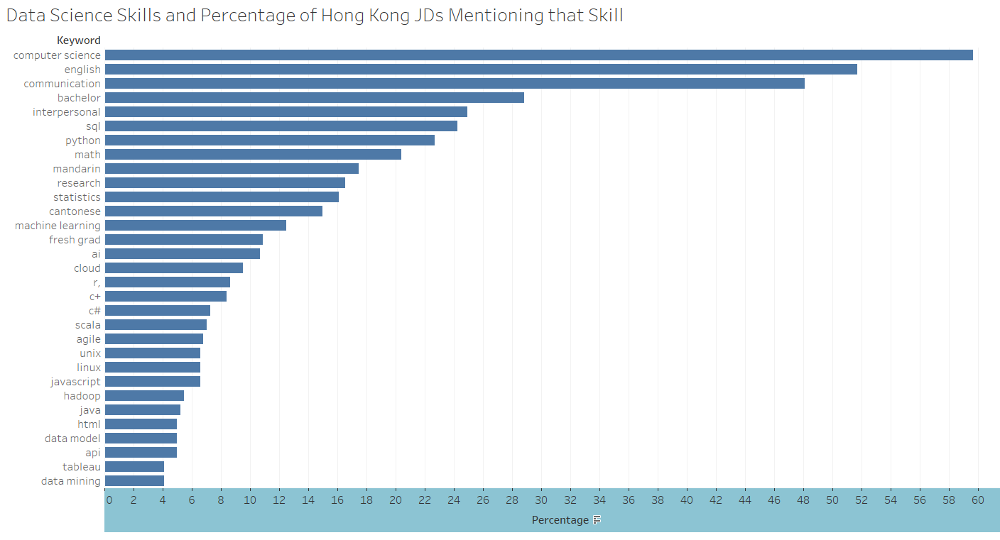
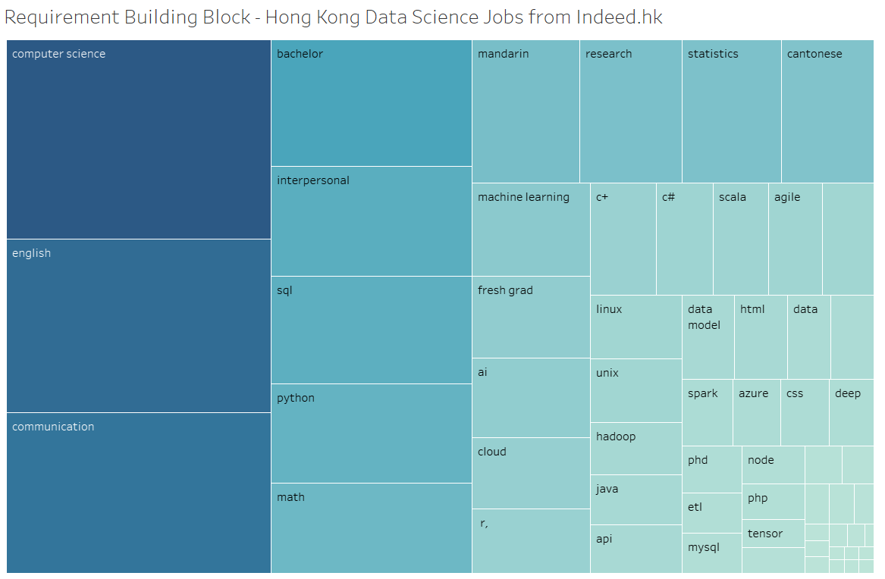

# Web Scraping Indeed.com for Data Science Job Requirements in Hong Kong

*By Danny Vu*

This data analysis will be using Python's Scrapy framework to scrape Indeed.com for Data Science Job Requirements. Indeed does have a [REST API](https://github.com/indeedassessments/api-documentation) but at the time of this writing, the API is still under construction so I will be performing web scraping.

After the web scraping of web pages linked to the search term `Data Science`, I will be analyzing the job description and generating visualizations of the top skills required for Data Science roles in Hong Kong.

### My Question: What are the main skills that a Data Scientist needs in Hong Kong?

As an American expat moving to Hong Kong, I was interested in finding out how difficult it would be to get a job as a data scientist in this country. My main concerns are the fact that I only speak English and that I only have a Bachelor's degree in Computer Science / Informatics. What are the skillsets that the job market looks for in Hong Kong?

### Summary of Results:
The main skills sought after were Computer Science, English, and Communication skills - no surprise there. What's surprising is that only 3-4% of Job Descriptions in Hong Kong mention a PHD requirement - which can often be seen as a requirement in the United States. Another nice touch for expats looking to get Data Science jobs in Hong Kong is that Cantonese and Mandarin are only mentioned as a requirement in about 15% of job descriptions and English is the dominant language in the job market here. Out of all the hard skills, SQL, Python, Statistics, and Machine Learning are the top sought after skills.

